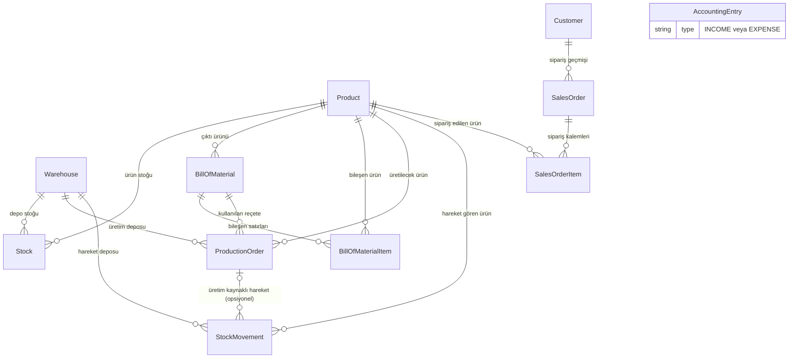
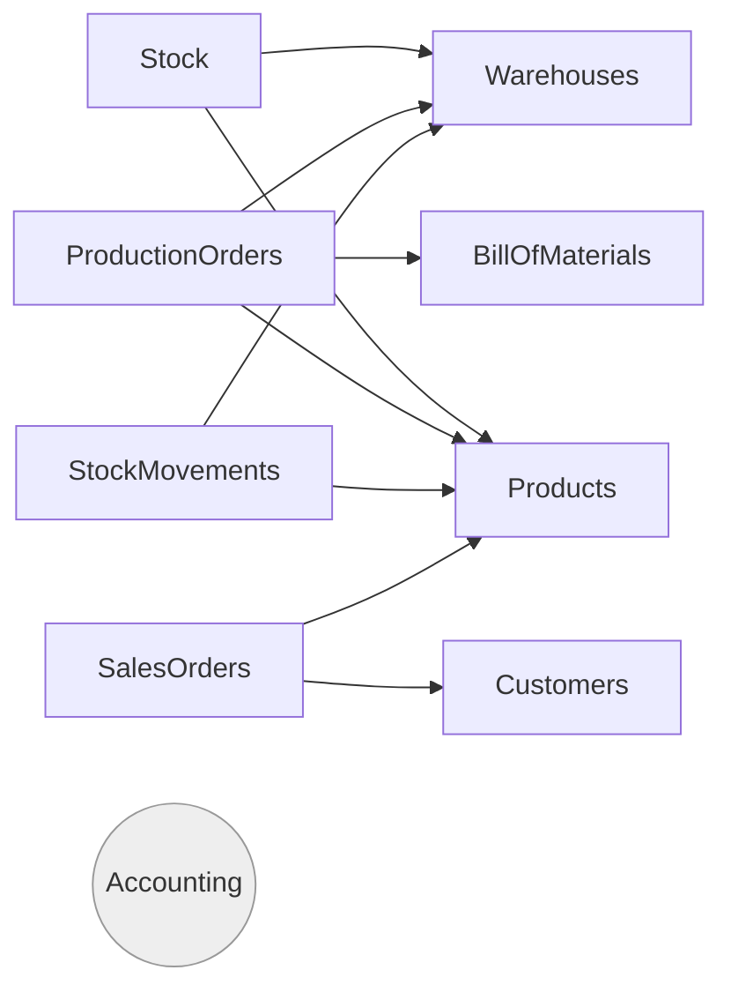

# Mimari

Bu doküman `mini-erp`'in klasör yapısını, katmanlarını ve Prisma 7 / ESM'e özgü yapılandırma kararlarını açıklar. Komutlar (build/test/lint/CLI) için `CLAUDE.md`'ye bakın.

## 1. Genel Bakış

`mini-erp`, envanter (Product/Warehouse/Stock/BOM/Üretim Emri), muhasebe (Accounting) ve CRM (Customer/Sales Order) domain'lerini kapsayan, **çift transport'lu** (REST HTTP API + terminal CLI) bir NestJS + Prisma + PostgreSQL uygulamasıdır. Her iki transport da aynı Service katmanını çağırır — HTTP Controller ve CLI Command, domain mantığını içermeyen ince adaptörlerdir. Amaç: "tek domain mantığı, birden fazla giriş noktası" prensibini somutlaştırmak. Modül-bazlı kısa açıklamalar için `README.md`'ye, modüller arası veri ilişkileri için §8'e bakın.

## 2. Klasör Yapısı

```
src/
  main.ts               # HTTP composition root
  app.module.ts
  cli.ts                # CLI composition root
  cli.module.ts

  prisma/
    prisma.module.ts     # @Global()
    prisma.service.ts    # PrismaClient + @prisma/adapter-pg

  generated/prisma/      # `npx prisma generate` çıktısı (gitignored)

  products/
    products.module.ts
    products.controller.ts   # HTTP katmanı
    products.service.ts      # domain/veri katmanı
    dto/
      create-product.dto.ts
      update-product.dto.ts
    cli/                      # CLI katmanı
      product.command.ts          # parent @Command
      product-create.command.ts   # @SubCommand
      product-list.command.ts     # @SubCommand

  warehouses/   # products/ ile aynı şablon
  stock/        # products/ ile aynı şablon + ProductsModule/WarehousesModule import'u

  bill-of-materials/    # BillOfMaterial (başlık) + BillOfMaterialItem (satır) — tek modül, ayrı item CRUD'u yok
  production-orders/    # ProductsModule + WarehousesModule + BillOfMaterialsModule import eder
  stock-movements/      # ProductsModule + WarehousesModule import eder; update/delete uç noktası yok (değiştirilemez ledger)

  accounting/    # AccountingEntry — diğer hiçbir modüle FK'sı olmayan bağımsız gelir/gider defteri
  customers/     # Customer — products/ ile aynı şablon (CRUD + soft-delete)
  sales-orders/  # SalesOrder (başlık) + SalesOrderItem (satır) — CustomersModule + ProductsModule import eder

  auth/
    api-key.guard.ts   # modülü yok; app.module.ts'te APP_GUARD olarak global kayıtlı (bkz. §8)
```

Her feature modülü kendi kendine yeten bir sınır: `dto/` (validasyon), `controller` (HTTP), `service` (domain+Prisma), `cli/` (terminal) — hepsi tek `*.module.ts`'te `providers`/`controllers` olarak kayıtlı. Yeni bir cross-cutting `src/cli/` üst klasörü **açılmadı**: CLI komutu, HTTP controller'ın terminal eşdeğeri olduğu için, o controller'ın yanında yaşıyor.

## 3. Katmanlar

```
HTTP Controller  ─┐
                   ├─→ Service ─→ PrismaService (generated Prisma Client) ─→ PostgreSQL
CLI Command       ─┘
```

- **Controller / Command**: girdi ayrıştırma (HTTP body / CLI flag'leri), DTO validasyonu, Service çağrısı, çıktı formatlama (JSON / `console.table`). İş kuralı içermez.
- **Service**: tek gerçek kaynak. `create/findAll/findOne/update/remove` + gerektiğinde `findByCode` gibi ek sorgu metodları. Prisma'ya doğrudan erişen tek katman.
- **PrismaService**: `@Global()` `PrismaModule` üzerinden her yerde inject edilebilir; `@prisma/adapter-pg`'nin `PrismaPg` adapter'ıyla PostgreSQL'e bağlanır.
- **Servisler arası bağımlılık**: bir Service, başka bir feature'ın Service'ini inject edebilir (örn. `ProductionOrdersService` → `BillOfMaterialsService.findActiveForProduct()`), Prisma sorgusunu tekrar yazmak yerine. Bu yüzden `X.module.ts`'nin `imports` dizisi, sadece controller/CLI'ın değil, servisin kendisinin ihtiyaç duyduğu diğer modülleri de içerir.
- **`StockMovementsService.create`**: `prisma.$transaction(async (tx) => {...}, { isolationLevel: 'Serializable' })` içinde çalışır — hem `StockMovement` satırını yazar hem `Stock.upsert` ile `quantity`'yi günceller (`*_IN` → artır, `*_OUT` → azalt). Çıkış hareketlerinde önce mevcut `quantity` okunur; istenen miktar mevcuttan fazlaysa `BadRequestException` ile reddedilir (negatif stok engellenir). `Serializable` izolasyon, aynı ürün+depo için eşzamanlı iki çıkışın kontrolü birlikte geçip stoğu birlikte eksiye düşürmesini (race condition) engeller.

## 4. Paylaşılan Katman

HTTP ve CLI arasında paylaşılan tek şey **Service class'ları** ve **DTO'lar**dır:

- HTTP: global `ValidationPipe({ whitelist: true, transform: true })` (`main.ts`) DTO'ları otomatik doğrular.
- CLI: her `create` komutu `plainToInstance(Dto, options)` + `class-validator`'ın `validate()`'ini **elle** çağırır — `ValidationPipe`'ın CLI eşdeğeri, aynı DTO/aynı kurallar.

Bu sayede bir validasyon kuralı tek yerde (DTO'da) tanımlanır, her iki transport da aynı şekilde uygular.

## 5. Prisma 7 Yapılandırması

Prisma 7, `schema.prisma`'daki klasik `datasource.url` alanını kaldırdı:

- **`prisma.config.ts`** (proje kökü) — `defineConfig({ datasource: { url: env('DATABASE_URL') }, ... })`; `prisma migrate`/`generate` CLI komutları bu dosyayı okur.
- **`schema.prisma`**'daki `generator client` bloğu `provider = "prisma-client"` + zorunlu `output = "../src/generated/prisma"` + `moduleFormat = "esm"` kullanır (eski `prisma-client-js` değil).
- **`PrismaService`** (`src/prisma/prisma.service.ts`), `PrismaClient`'i `@prisma/adapter-pg`'nin `PrismaPg` driver adapter'ıyla instantiate eder — connection string'i constructor'da `process.env.DATABASE_URL`'den okur.
- Üretilen client `src/generated/prisma/`'da (gitignored) — `npx prisma generate` ile yeniden oluşturulur, `node_modules` içinde değildir.

## 6. ESM / Modül Konvansiyonları

- `package.json`: `"type": "module"`; `tsconfig.json`: `"module"`/`"moduleResolution": "nodenext"`.
- **Tüm relative import'lar `.js` uzantısıyla yazılır** (`from './products.service.js'`), kaynak `.ts` olsa bile — `nodenext` bunu zorunlu kılar.
- Enum'lar `../../generated/prisma/enums.js`'den import edilir, `@prisma/client`'tan değil.
- `main.ts` ve `cli.ts`, ilk satırda `import 'dotenv/config'` içerir — derlenmiş `dist/*.js` doğrudan `node` ile çalıştırıldığında `.env`'i yükleyen başka bir mekanizma yok; `PrismaService` constructor'ı `process.env.DATABASE_URL`'i doğrudan okuduğu için bu satır olmadan bağlantı kurulamaz.

## 7. Giriş Noktaları

| | HTTP | CLI |
|---|---|---|
| Entry dosyası | `src/main.ts` | `src/cli.ts` |
| Composition root | `AppModule` (+ global `ApiKeyGuard`, bkz. §8) | `CliModule` (`PrismaModule` + tüm feature modülleri, `AppController`/`AppService`/guard gibi HTTP'ye özgü şeyler yok — CLI'da API key koruması uygulanmaz) |
| Bootstrap | `NestFactory.create()` + `app.listen()` | `nest-commander`'ın `CommandFactory.run()`'ı |
| Validasyon | Global `ValidationPipe` | Komut içinde manuel `plainToInstance` + `validate()` |
| Çalıştırma | `npm run start:dev` (watch) / `npm run build && npm run start:prod` | `npm run build && npm run cli -- <komut>` (bkz. not aşağıda) |

**Not:** CLI için `tsx` tabanlı hızlı bir dev script denendi ve kaldırıldı — `tsx` (esbuild), NestJS'in DI'ının ihtiyaç duyduğu `design:paramtypes` decorator metadata'sını güvenilir şekilde üretmiyor; komutlar hatasız derleniyor ama constructor'a inject edilen servisler çalışma anında `undefined` geliyordu. Bu yüzden `cli` script'i doğrudan `tsc` ile derlenmiş `dist/cli.js`'i çalıştırır — CLI'ı çalıştırmadan önce her zaman `npm run build` gerekir.

## 8. Modüller Arası İlişkiler

### 8.1 Veri modeli (Prisma FK ilişkileri)

`prisma/schema.prisma`'daki foreign key'lere göre modüller arası veri ilişkisi:



`AccountingEntry` diyagramda kasıtlı olarak izole bırakıldı: hiçbir tabloya FK'sı yok, tamamen bağımsız bir gelir/gider defteri (`Sipariş tamamlandı → gelir kaydı oluştur` gibi bir otomasyon **yok**; muhasebe kayıtları elle açılır).

Önemli kısıtlar (silme davranışı):
- `Stock`/`ProductionOrder`/`StockMovement`/`BillOfMaterialItem`/`SalesOrderItem` → `Product`/`Warehouse`/`Customer`: **`onDelete: Restrict`** (bağımlı kayıt varken ebeveyn hard-delete edilemez).
- `BillOfMaterialItem` → `BillOfMaterial`, `SalesOrderItem` → `SalesOrder`: **`onDelete: Cascade`** (başlık silinince satırlar da silinir).
- `StockMovement.productionOrderId` → `ProductionOrder`: **`onDelete: SetNull`** (üretim emri silinirse hareket kaydı, `productionOrderId` alanı `null`'lanarak korunur — ledger asla silinmez).

Bu Restrict/Cascade/SetNull davranışının gerçek bir Postgres üzerinden uçtan uca doğrulaması için `test/integration.e2e-spec.ts`'ye bakın (geçersiz FK referansıyla `StockMovement` oluşturma denemesinin DB seviyesinde reddedildiğini de kapsar — `StockMovementsService.create`, `productId`/`warehouseId`'yi servis katmanında önceden doğrulamaz, bütünlük tamamen DB FK kısıtına bırakılmıştır).

### 8.2 Modül bağımlılık grafiği (NestJS `imports` / servisler arası inject)

Bir modülün `imports` dizisinde başka bir feature modülü varsa, bu genelde o modülün Service'ini inject ettiği anlamına gelir (bkz. §3 "Servisler arası bağımlılık"):



- `ProductionOrdersService`, `bomId` verilmediğinde `BillOfMaterialsService.findActiveForProduct()`'ı gerçekten çağırır — bu tek **kullanılan** cross-module servis bağımlılığı.
- `StockModule`'ün `Products`/`Warehouses` import'u, `StockCreateCommand`'ın kod→ID çözümlemesi için kullanılır.
- `SalesOrdersModule`, `CustomersModule` ve `ProductsModule`'ü import eder ama `SalesOrdersService` şu an bu servisleri **çağırmaz** — `customerId`/`productId` geçerliliği (§8.1'de belirtildiği gibi) sadece DB FK kısıtına bırakılmıştır, servis katmanında ön-doğrulama yoktur. Bu, `StockMovementsService` ile aynı, projede tutarlı bir tasarım tercihi.
- `Accounting` hiçbir modülü import etmez, hiçbir modül de onu import etmez — hem veri hem modül grafiğinde tamamen izole.
